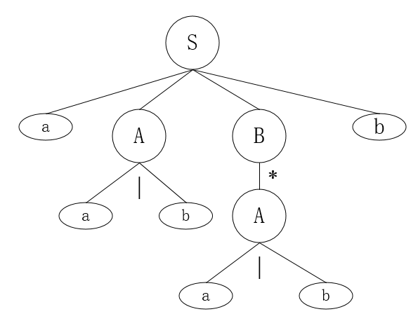
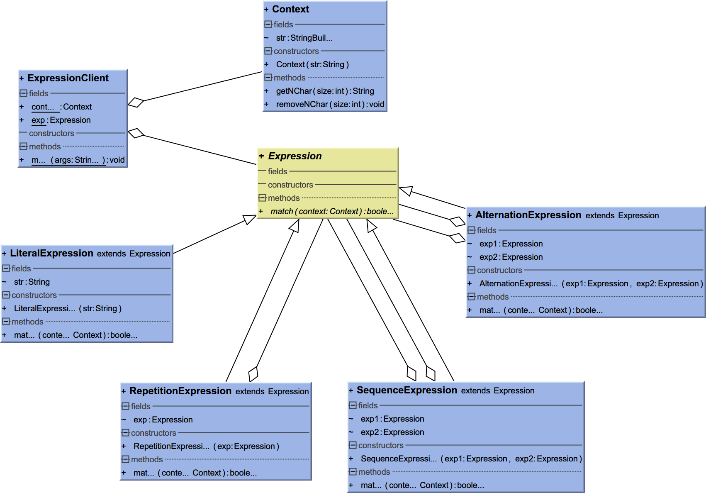
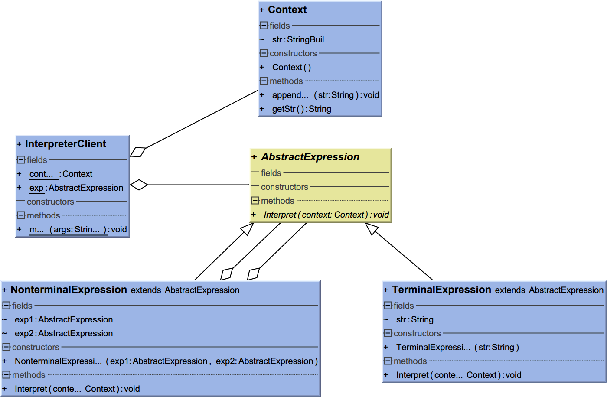

解释器模式（Interpreter）
========================	

解释器模式是根据已有的形式文法（[wiki](http://en.wikipedia.org/wiki/Formal_grammar)），给出一个解释器来解释指定的抽象语法树（Abstract Syntax Tree，[wiki](http://en.wikipedia.org/wiki/Abstract_syntax_tree)）。如果没了解过编译原理，这句话可能会有点晦涩，通俗地讲，就是我们根据规则来构造一些特定的规则树，然后给出一个规则解释器，解释这个规则树。
可以参考《设计模式》中的Intent:
> Given a lanuage, define a represention for its grammar along with an
> interpreter that uses the representation to interpret sentences in the 
> language.


这样举栗子不知道行不行
-----------------------


实际上解释器模式的应用场景比较抽象，估计要看多几个栗子会比较好理解一点，所以除了本文的demo外，参考资料中也提供了几个代码。
先来个正则表达式超级简化版吧，就是《设计模式》中第一个例子，不过我没有加parser。假设我们要做一个字符串的正则匹配，文法如下:

```
expression ::= literal | alternation | sequence | repetition | '(' expression ')'
alternation ::= expression '|' expression
sequence ::= expression '&' expression
repetition ::= expression '*'
literal ::= 'a' | 'b' | 'c' | ... { 'a' | 'b' | 'c' | ... }*
```

如果之前没了解过形式文法相关内容的话，这些规则可能有点晦涩，如果了解过的话，可以跳过下面这段解释：
- "::=" 这个符号表示推导，该符号左边的符号expression, alternation, sequence, repetition, literal是文法符号(就是后面可能会提到的symbol)，推导符号的右边则是规则表达式，就是左边符号可以推导为右边。
- 初始符号，在上面的文法中就是expression，初始符号表示该文法能够表示的所有句子（上面文法中的句子就是我们要匹配的正则表达式）
- 终结符号，就是上面的literal，因为它不再含有其它符号，有具体的表示意义，它的推导式不能再继续推导。
- 非终结符号，就是上面的expression，alternation，sequence，repetition等，因为它们的推导式还可以继续推导为别的表达式。
- | 表示或，就是可以推导为前面或者后面的其中一个。
```
eg. 
A ::= exp1 | exp2 , exp1 ::= 'dog' , exp2 ::= 'cat',
那末，A可以推导为'dog'或者'cat'中的一个。
```
-  两个符号之间的空格表示连接，就是可以推导为前面表达式连接着后面的表达式。
```
eg. 
A ::= exp1 exp2 , exp1 ::= 'dog' , exp2 ::= 'cat',
那末，A可以推导为'dogcat'
```
- '\*' 表示闭包，可以看作重复，exp\*表示拥有0个或者有限个数的exp。
```
eg. 
A ::= exp1* , exp1 ::= 'a' 
那末，A可以推导为 '','a', 'aa', 'aaa'...
```
- 上面的文法中，单引号所包含的内容为直接字符串。
- 给个小栗子吧，下面是一个以a开头，中间有无数个a或者b(至少有一个)，并以b结尾的字符串的表示文法。
```
小写字母表示终结符，大写字母表示非终结符，S是初始符号
S ::= aABa
B ::= A*
A ::= (a | b)
这个文法可以表示为：a(a | b)(a | b)*b
```
- 想要更深入了解形式文法，猛戳[wiki](http://zh.wikipedia.org/wiki/%E5%BD%A2%E5%BC%8F%E6%96%87%E6%B3%95)


好了，文法介绍完了。通常。。。没有通常，要弄这种类型的检测除了自动机，貌似没有一些很好的方法，还有就是本文讲的解释器模式。

怎么吃栗子
----------------
到这里，假设大家都对形式文法有个初步的了解了。解释器模式就是专门为了解释依据这些文法产生的表达式语句（更进一步可以说是抽象语法树），比如上面栗子中的a(a | b)(a | b)*b就是根据它的文法产生的一条表达式语句（也是一棵抽象语法树）。看图可能会形象一点，用visio随便画的，不要介意。



现在我们不得不提的一个概念就是"解释"(Interprete)啦。通常"解释"可以叫做翻译，就是把所有的这些终结符和非终结符转换为我们需要的操作的过程。比如我们要做字符串匹配检测，那我们的"解释"就是看该字符串是否符合我们所构造的抽象语法树，也就是对于语法树中的每一个节点（symbol,终结符和非终结符）它都能一一对应。
另一个很重要的概念就是上下文（Context）,在字符串匹配检测中，我们需要检测的字符串就是上下文。

大体的结构是:
- 每一个symbol(终结符和非终结符)，我们都用一个类(AlternationExpression, RepetitionExpression...)来表示，都继承自初始符号的类(Expression)，所以我们可以把symbol都看作一个Expression类，非终结符类中会持有Expression对象表示要推导的内容(这里有点类似组合模式)。看代码:

Expression类
```
public abstract class Expression {
    public abstract boolean match(Context context);
}
```

其中一个非终结符类RepetitionExpression
```
public class RepetitionExpression extends Expression{

    Expression exp;

    public RepetitionExpression(Expression exp){
        this.exp = exp;
    }

    @Override
    public boolean match(Context context) {
        while(exp.match(context)){
        }
        return true;
    }
}
```

终结符类LiteralExpression
```
public class LiteralExpression extends Expression{

    String str;

    public LiteralExpression(String str){
        this.str = str;
    }

    @Override
    public boolean match(Context context) {
        String temp = context.getNChar(str.length());
        if(temp == null || !temp.equals(this.str)){
            return false;
        }

        context.removeNChar(str.length());
        return true;
    }
}
```

- 大家可以看出，我们有个match函数，这里的match函数就是我们的解释函数。抽象语法树上的每一个节点符号（symbol）都是一个Expression的对象，所以每一个symbol都重写match来检测是否符合该Expression的推导，再返回结果到上一层。

- Context上下文，通常用来保存上下文状态和内容，我们的字符串匹配检测的上下文比较简单，就是一个字符串，然后提供一些Expression需要使用到的字符串操作方法。
看代码:

```
public class Context {
    StringBuilder str;

    public Context(String str){
        this.str = new StringBuilder();
        this.str.append(str.toCharArray());
    }

    public String getNChar(int size){
        if(str.length() < size){
            return null;
        }

        return this.str.substring(0, size);
    }

    public void removeNChar(int size){
        try{
            this.str.delete(0, size);
        }catch(Exception e){
        }
    }
}
```

- 现在看测试代码，我们创建了一个比较简单的语法树(apple | orange)*dog，然后检测字符串(appleappleorangeappledog)是否符合该语法树。


```
public class ExpressionClient {

    public static Context context;
    public static Expression exp;

    public static void main(String[] args){
        context = new Context("appleappleorangeappledog ");
		
		// 创建语法树
        Expression exp1 = new LiteralExpression("apple");
        Expression exp2 = new LiteralExpression("orange");
        Expression exp3 = new AlternationExpression(exp1, exp2);
        exp1 = new RepetitionExpression(exp3);
        exp3 = new LiteralExpression("dog");
        exp = new SequenceExpression(exp1,exp3);

		// 解释，也就是检测context是否符合该语法树
        System.out.print(exp.match(context));
    }
}
```

照例高清无码UML图
------------------


附送一张抽象语法树的图（从《设计模式》中拿的，非常形象）


栗子好吃吗
-----------
- 解释器模式并没有包含语法分析器([Parser](http://en.wikipedia.org/wiki/Parsing))
	
也就是说抽象语法树要自己构建，本文的demo中我没有写语法分析器，只是随便构造了一个抽象语法树，在实例代码(参考资料2)中使用了parser来构建抽象语法树。

- 每一个符号类（包括终结符和非终结符）都有一个解释函数（我们这里是match函数），用来解释当前上下文（Context），当抽象语法树中的每一个对象（也就是节点，或者说符号）都解释完了后，整个解释过程就结束了。

- 通常非终结符的对象在进行解释的同时，会把上下文传给它的子节点（非终结符或者终结符）进行递归解释。

- 这里有个重点是Context，每一个解释函数这里的上下文可以是很多东西，比如我们做字符串匹配检测，上下文就是字符串，每一次的解释如果成功就会消耗相应的字符。如果做字符串求值的话，context就可以用一个table来表示。

- 注意，不同的应用场景Context类就不一样，怎样写Context类取决于每一个符号要怎么样去使用它。每个解释函数的参数都是context对象。

- 单纯看几个模块的结构就是组合模式，因为非终结符对象中持有其它的符号对象。

- 进一步讲，我们的解释其实就是一个个解释函数排着队来解释语法树，不同的语法树就相当于不同的解释队列，不过把它画成树形比较形象又容易理解。

总结一下
--------
解释器模式的几个主要部分：
- AbstractExpression: 通用的符号类，也就是文法的初始符号，所有符号的父类。
- TerminalExpression: 终结符类，抽象语法书的叶子节点，通常最终解释工作在这里。
- NonterminalExpression: 非终结符类，通常持有其他符号类的引用。
- Context: 上下文，就是解释函数需要"查表"的地方，做为每一个解释函数的参数。
- Interprete: 解释函数，非终结符有点像分派器的样子，指派自身持有的符号对象的解释函数去解释上下文，我们上面的demo中的match就是解释函数。
- 模式用途：在编译器中用得比较多，《设计模式》中提到两个，一个是做类似于上面demo的各种表达式（字符串）检测，还有一个打印一些漂亮的字符图案，打印字符图案这个我找到一个例子（参考资料3）。

标准的解释器模式UML图
-----------------------



优缺点
-------------
这没有很多应用经验，主要参考《设计模式》
1. 	文法很容易修改 
	很明显，我们要修改或者添加文法只要继承一个原来的符号类或者直接继承初始符号类，然后写新的解释函数就可以了。
2.	文法的实现也比较简单
	当然，根据规则来编写符号类看起来不会太难。还是抽象语法树的生成会比较棘手。
3.	复杂文法比较难以控制
	在解释器模式中，每一条文法规则（推导式）都是实现成一个类。所以对于复杂文法，至少看起来会比较乱，这不是重点，解释器模式的前提是客户端建好了抽象语法树，对于复杂文法来说，呵呵，特么单单是抽象语法树就想屎了。。。不知道性能会不会很渣，《设计模式》中推荐复杂文法使用语法分析器或者其他的一些编译器技术来实现，直接跳过抽象语法树，对，直接跳过，语法分析的时候就可以进行解释了。
4.  如果要添加新的解释函数很方便，直接在每个类中写就好，如果嫌麻烦，或者真的很多东西要添加，那试一下用访问者模式给现有代码添加新的方法吧，下一篇会介绍访问者模式。

现实中的应用
-------------
- smalltalk语言的编译器实现
- SPECtalk中用来对输入文件描述的格式检测
- 有些工具用来做约束条件检测

好基友们
---------
- 组合模式 : 只看符号类那一部分，没有解释函数和上下文的话其实就是一个组合模式。
- 访问者模式 : 这个可以用来给已有的树结构节点添加新的方法，解释器模式可以配合访问者模式来愉快地添加解释函数，实现更多更美好的功能。

一些废话
----------
这篇东西把我仅有的一点点编译原理知识都快用完了，做为一个编译原理课程上只是实现了一个包含算术表达式简单语言渣渣表示话语权不多，如有错漏，烦请指出，如有问题，可以看形式文法，自动机，编译原理等相关内容。

参考资料
---------
个人觉得解释器模式可能不够常用，而且相比其它的一些设计模式较为晦涩，所以给出几个参考资料地址:
1.	[本文实例demo](https://github.com/mck-dajiao/DesignPatterns.git)
2.	[CodeProject示例](http://www.codeproject.com/Articles/186183/Interpreter-Design-Pattern)
3.  [打印图案栗子](http://www.cnblogs.com/xieziyu/p/3645410.html)
4.	[算术表达式解释器例子](http://www.cnblogs.com/chenssy/p/3346427.html)
5.	[语法分析](http://en.wikipedia.org/wiki/Parsing)
6.  [形式语言与自动机](http://goo.gl/n2QKZJ)
7.	[编译原理(电子工业出版社第三版)](http://goo.gl/G5dQLX)
8.  [编译原理(龙书)](http://goo.gl/Z0AFpV)
9.  [设计模式](http://goo.gl/uDG8cb)
10.	[解释器模式wiki](http://en.wikipedia.org/wiki/Interpreter_pattern)
