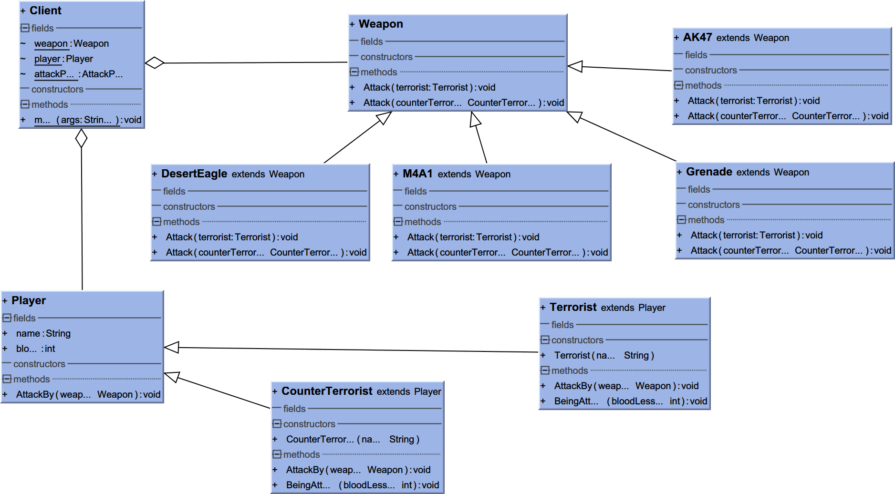

访问者模式(Visitor)
===================

访问者模式主要内容有两点，第一个是访问对象结构（通常是一棵对象树或者一些结构化的对象集合），第二个就是在单分派语言上实现二分派啦。在《设计模式》中的解释是，访问者模式可以让你在不改动原有对象结构（代码）的基础上给对象们添加新操作（方法）。

照例来段原文，方便自己解释
> Represent an operation to be performed on the elements of an object
> structure. Visitor lets you define a new operation without changing the
> classes of the elements on which it operates.

多分派
-------

假如你知道什么是多分派([multiple dispatch](http://en.wikipedia.org/wiki/Multiple_dispatch))可以跳过这一段。

栗子
-----


我们来模拟一个动物吃食物的过程，先看下参战双方，动物这边有Cat和Dog，都是继承自Aninamal，并重写了其中的3个不同签名的eat方法。Animal的eat方法是用来吃食物的，参数就是Food类。

```java
Animal类
public class Animal {
    public void eat(Food food){
        System.out.println("Animal eat Food");
        System.out.println(food.getClass().toString());
    }

    public void eat(Fish fish){
        System.out.println("Animal eat Fish");
        System.out.println(fish.getClass().toString());
    }

    public void eat(Mutton mutton){
        System.out.println("Animal eat Mutton");
        System.out.println(mutton.getClass().toString());
    }
}

Cat 继承自Animal
public class Cat extends Animal{
    @Override
    public void eat(Food food){
        System.out.println("Cat eat Food");
        System.out.println(food.getClass().toString());
    }
    @Override
    public void eat(Fish fish){
        System.out.println("Cat eat Fish");
        System.out.println(fish.getClass().toString());
    }
    @Override
    public void eat(Mutton mutton){
        System.out.println("Cat eat Mutton");
        System.out.println(mutton.getClass().toString());
    }
}

Dog 继承自Animal
public class Dog extends Animal{
    @Override
    public void eat(Food food){
        System.out.println("Dog eat Food");
        System.out.println(food.getClass().toString());
    }
    @Override
    public void eat(Fish fish){
        System.out.println("Dog eat Fish");
        System.out.println(fish.getClass().toString());
    }
    @Override
    public void eat(Mutton mutton){
        System.out.println("Dog eat Mutton");
        System.out.println(mutton.getClass().toString());
    }
}
```

下面是我们的食物类，有Fish，Mutton，继承自Food。

```java
public class Food{}
public class Mutton extends Food{}
public class Fish extends Food{}
```

大家都知道，java的多态(Polimorphism)是在运行时动态地根据具体对象来选择实际要调用哪个方法（也就是重写Override）。另外需要提一下的是重载（Overload），重载是根据方法的不同参数（签名）来调用不同的方法，不过，jvm对重载在预处理的时候实际上是把签名合并到方法名中去了，所以实际上是两个不同方法名的方法。

好了，我们开始看下面的测试代码
```java
Animal animal;
Food food;
Mutton mutton;

animal = new Dog();
food = new Fish();
mutton = new Mutton();

animal.eat(mutton);
animal.eat(food);
```

众所周知，根据java的多态性，animal.eat(food)，我们调用的是Dog里面重写的eat方法，Dog里面有3个不同签名的eat方法，到底调的是哪一个呢？没错，是eat(Food)，而不是eat(Fish)，虽然传给eat方法的确实是fish对象，虽然挂了个Food的外号。只有倒数第二条语句(animal.eat(mutton))才会用到Overload的福利，成功调用到了eat(Mutton)。

为毛？因为java是单分派语言，也就是说它的多态性在一条语句上只能针对一个对象，通常对于大部分单分派语言，这个对象就是调用方法的对象，比如上例中的animal，所以后面的food就不能再通过多态来分派了。（常见的OO语言都是单分派，比如C#，C++,python等）。
这就是为什么我们的animal可以成功地被辨识为dog，但是方法里面的参数中的food就不能在运行时被辨识为Fish。

那末这样子就很容易知道多分派语言是什么啦，就是对一条语句上的多个对象可以同时使用多态性，那么后面food也可以被识别为fish。
多分派语言比较有名的是([Common Lisp](http://en.wikipedia.org/wiki/Common_Lisp))，哇，函数式编程语言喔，看起来就很高大上对吧。

[代码github地址](https://github.com/mck-dajiao/DesignPatterns/tree/master/src/dajiao/Visitor/DispatchTest)

ps: java，c++中的单分派具体实现在这里没有分析，有兴趣可以看参考资料，common lisp完全没看过，有时间再看下。

我们来模拟一个双分派
--------------------

访问者模式一个重点就是实现伪双分派，对于多分派语言来说，没有访问者模式，因为它在语言层面提供了支持。但是单分派语言像java，c++这些来说，可以通过访问者模式来实现伪双分派（注意只是双分派，不是多分派）。

那么用单分派来实现伪双分派要怎样来实现呢？前面说过的运行时多态的继承链寻找中，我们只能根据一条链去寻找，也就是上面的代码中animal的继承链。
上面的animal.eat(food)虽然不能根据food的具体对象进行方法的分派，但是在eat方法里面我们如果调用food.getClass()是可以知道food是fish的实例的。

所以一种不够优雅的方法是，选择分支结构实现分派：
```java
public Dog extend Animal{
	public void eat(Food food){
		if(food.getClass().equals(fish.getClass())){
			// call the eat fish method
			eatFish(food);
		}else if(food.getClass.equals(mutton.getClass()){
			// call the eat mutton method
			eatMutton(food);
		}else{
		...
	}
...
}
```

这样我们在每一个Animal的子类中都要写一堆复杂的选择结构，聪明如你一定想到我们可以直接利用多态（单分派）来分派，从而实现第二次分派，于是代码如下：
```java
public Dog extend Animal{
	public void eat(Food food){
		food.eatByDog();
	}	
}
```
看！这样我们的参数food在eat中变成了调用方法的对象，也就是在java中可以利用单分派！
大家可以看到上下两种实现方式的不同，上面的分支结构中有关eat业务的具体实现都是在Dog中实现的，虽然分支结构比较麻烦，但是可以保证类的封装完整。
下面的方式就是访问者模式的实现方式，虽然优雅简洁，但是具体有关eat业务的实现代码却是在Food类的实例中实现的，所以还要把Dog的实例传给Food的实例，这样Dog就得开放自己的一些属性或者方法给Food类的实例（因为业务可能会涉及到修改属性等等），使得类封装性有所下降。

[代码github地址](https://github.com/mck-dajiao/DesignPatterns/tree/master/src/dajiao/Visitor/DispatchTest)

伪多分派？
---------

这没有讨论伪多分派，理论上上面的两种方法也可以一样实现伪多分派，但是三者或者更多对象之间发生关系没有多分派的话，本身就很复杂了，所以这里没有讨论。

看个伪多双派和简单对象结构的栗子
--------------------------------

访问者模式的另一个重点是在具有一定对象结构（比如树或者集合之类的）上进行遍历访问添加操作。

我们玩CS的时候，玩家(Player)可以扮演反恐精英(CounterTerrorist)和恐怖分子(Terrorist)在打架，武器(Weapon)有AK47，M4A1，高爆手雷，烟雾弹，匕首等等。这样我们可以定义人(Player,包括反恐精英和恐怖分子)有一个AttackBy(Weapon)方法，参数是Weapon类，表示该玩家被该武器袭击。
Weapon类则是有Attach(Player)方法，表示该武器袭击了玩家，从而可以调用该玩家类型的各种方法来进行相应的业务，属性的改变，比如掉血，掉钱等。


我们看下两段代码，反恐精英的代码：
```java
public class CounterTerrorist extends Player{
    public CounterTerrorist(String name){
        this.blood = 100;
        this.name = name;
    }

    @Override
    public void AttackBy(Weapon weapon) {
        weapon.Attack(this);
    }

    public void BeingAttack(int bloodLessen){
        if(bloodLessen >= this.blood){
            this.blood = 0;
            System.out.println("the CounterTerrorist " + this.name + " is Dead!");
        }else{
            this.blood -= bloodLessen;
            System.out.println("the CounterTerrorist " + this.name + " cutting " +
                    String.valueOf(bloodLessen) + " blood!");
        }
    }
}
```
AK47的代码：
```java
public class AK47 extends Weapon{
    @Override
    public void Attack(Terrorist terrorist) {
        terrorist.BeingAttack(75);
    }

    @Override
    public void Attack(CounterTerrorist counterTerrorist) {
        counterTerrorist.BeingAttack(85);
    }
}
```

那么，我们实际在处理这些的攻击的事件的时候可能是通过维持一条攻击队列，里面是每一个攻击事件，所以具体的测试端代码是：
```java
public class Client {
    static Weapon weapon;
    static Player player;
    static AttackPair attackPair;

    public static void main(String[] args){
        Queue<AttackPair> attackQueue = new LinkedBlockingQueue<AttackPair>();

        Player ter1 = new Terrorist("xiaoming");
        Weapon ter1Wp = new AK47();
        Player ter2 = new Terrorist("xiaoli");
        Weapon ter2Wp = new DesertEagle();
        Player cTer = new CounterTerrorist("xiaohong");
        Weapon cTerWp = new M4A1();
        Weapon cTerWp2 = new Grenade();

        // the war start...
        attackQueue.add(new AttackPair(ter1, cTerWp));
        attackQueue.add(new AttackPair(cTer, ter2Wp));
        attackQueue.add(new AttackPair(ter2, cTerWp));
        attackQueue.add(new AttackPair(ter2, ter1Wp));
        attackQueue.add(new AttackPair(ter1, cTerWp2));

        // we won't simulate the consumer
        // just take the exact number of the attackPair
        for(int i= 0; i<5;i++){
            attackPair = attackQueue.poll();
            attackPair.getPlayer().AttackBy(attackPair.getWeapon());
        }
        // game over! Couter-Terrorist Win!
    }
}
```

[代码github地址](https://github.com/mck-dajiao/DesignPatterns/tree/master/src/dajiao/Visitor/CounterStrike)

CS栗子UML图
-------------


在字符串识别中使用访问者模式
----------------------------

我在解释器模式中写了一个字符串识别的栗子来解释，我们可以利用字符串识别来继续解释访问者模式。
字符串识别的栗子的细节就不再介绍了，下面介绍新添加的内容。我们的目的是给我们字符串识别的抽象语法树的每一个节点上添加一些操作，这里是有两个操作，分别是打印节点信息(通过PrintMessageVisitor)，节点字符串的小写转大写(通过CapTranslateVisitor)。

如果没有访问者模式，我们可以通过给每一个节点来添加打印函数和小写转大写方法来实现上面的功能。酱紫的话，我们每需要添加一个节点操作的时候都需要改所有的节点源代码，不优雅啊不优雅，注定加班一生。。。。

利用伪双分派，我们可以很轻松实现而不用去改动我们节点的内容，我们只需要节点类中开一个口子，也就是Accept方法，通过把需要添加的操作类的实例传进去，那么这样我们没添加一个操作就只需写一个新的操作类就可以了。

访问者模式中有访问者类Visitor定义了访问每一个需要被访问节点的方法，所有的访问者都继承自Visitor。然后，需要被访问的节点里面也需要定义一个Accept方法，接受Visitor类的实例做为参数，然后visitor类就可以对节点进行操作了。

```java
伪代码
public class node{
	public void accept(Visitor visitor){
		visitor.visit(this);
	}
}

node.accept(visitor);
```

下面看字符串识别类代码：

我们先定义访问者类的父类：
```java
public class ExpressionVisitor {
    public void visit(LiteralExpression literalExpression){}
    public void visit(RepetitionExpression repetitionExpression){}
    public void visit(SequenceExpression sequenceExpression){}
    public void visit(AlternationExpression alternationExpression){}
}
```
具体的两个访问类：
```java
public class PrintMessageVisitor extends ExpressionVisitor{
    @Override
    public void visit(LiteralExpression literalExpression) {
        System.out.println("the current node is " + literalExpression.getClass().toString());
        System.out.println("so the str of current terminal node is " + literalExpression.getStr());
    }

    @Override
    public void visit(RepetitionExpression repetitionExpression) {
        System.out.println("the current node is " + repetitionExpression.getClass().toString());
    }

    @Override
    public void visit(SequenceExpression sequenceExpression) {
        System.out.println("the current node is " + sequenceExpression.getClass().toString());
    }

    @Override
    public void visit(AlternationExpression alternationExpression) {
        System.out.println("the current node is " + alternationExpression.getClass().toString());
    }
}

public class CapTranslateVisitor extends ExpressionVisitor{
    @Override
    public void visit(LiteralExpression literalExpression) {
        literalExpression.setStr(literalExpression.getStr().toUpperCase());
    }

    @Override
    public void visit(RepetitionExpression repetitionExpression) {
        super.visit(repetitionExpression);
    }

    @Override
    public void visit(SequenceExpression sequenceExpression) {
        super.visit(sequenceExpression);
    }

    @Override
    public void visit(AlternationExpression alternationExpression) {
        super.visit(alternationExpression);
    }
}
```

下面是节点中的Accept方法，把上面的访问者实例传进去。
```java
非终止节点
public class RepetitionExpression extends Expression {
	...
    @Override
    public void Accept(ExpressionVisitor visitor) {
        visitor.visit(this);
        exp.Accept(visitor);
    }
}

终止节点
public class LiteralExpression extends Expression {

    String str;

    public LiteralExpression(String str){
        this.str = str;
    }

    @Override
    public boolean match(Context context) {
        String temp = context.getNChar(str.length());
        if(temp == null || !temp.equals(this.str)){
            return false;
        }

        context.removeNChar(str.length());
        return true;
    }

    @Override
    public void Accept(ExpressionVisitor visitor) {
        visitor.visit(this);
    }

    public String getStr() {
        return str;
    }

    public void setStr(String str){
        this.str = str;
    }
}
```
下面看测试代码：

```java
public class ExpressionClient {

    public static Context context;
    public static Expression exp;
    public static ExpressionVisitor visitor;

    public static void main(String[] args){
        context = new Context("appleappleorangeappledog ");

        Expression exp1 = new LiteralExpression("apple");
        Expression exp2 = new LiteralExpression("orange");
        Expression exp3 = new AlternationExpression(exp1, exp2);
        exp1 = new RepetitionExpression(exp3);
        exp3 = new LiteralExpression("dog");
        exp = new SequenceExpression(exp1,exp3);

        System.out.println(exp.match(context));

        visitor = new PrintMessageVisitor();
        exp.Accept(visitor);
        visitor = new CapTranslateVisitor();
        exp.Accept(visitor);
        visitor = new PrintMessageVisitor();
        exp.Accept(visitor);
    }
}
```

输出结果：

```
true
the current node is class dajiao.Visitor.Expression.SequenceExpression
the current node is class dajiao.Visitor.Expression.RepetitionExpression
the current node is class dajiao.Visitor.Expression.AlternationExpression
the current node is class dajiao.Visitor.Expression.LiteralExpression
so the str of current terminal node is apple
the current node is class dajiao.Visitor.Expression.LiteralExpression
so the str of current terminal node is orange
the current node is class dajiao.Visitor.Expression.LiteralExpression
so the str of current terminal node is dog
the current node is class dajiao.Visitor.Expression.SequenceExpression
the current node is class dajiao.Visitor.Expression.RepetitionExpression
the current node is class dajiao.Visitor.Expression.AlternationExpression
the current node is class dajiao.Visitor.Expression.LiteralExpression
so the str of current terminal node is APPLE
the current node is class dajiao.Visitor.Expression.LiteralExpression
so the str of current terminal node is ORANGE
the current node is class dajiao.Visitor.Expression.LiteralExpression
so the str of current terminal node is DOG
```

[代码github地址](https://github.com/mck-dajiao/DesignPatterns/tree/master/src/dajiao/Visitor/Expression)

字符串识别高清无码UML
-----------------------


又到了抽象的季节
-----------------
总结一下，主要组成部分：
- Visitor: 访问者的父类，定义了访问所有类型节点的访问方法，访问者是给访问节点添加操作的类
- ConcreteVisitor: 具体的访问者类，实现具体的访问方法，也就是添加的操作
- Element: 被访问节点的父类，定义了Accept方法，接收Visitor类实例的访问
- ConcreteElement: 具体的被访问节点，继承了父类Element的Accept方法
- 对象结构: 访问者模式主要是在一些对象集合，通常是一些树，或者有结构的对象集合，又或者是队列，列表上面进行遍历访问，所以这个比较重要。上面CS栗子中的攻击处理队列，字符串识别栗子中预定义的字符串结构等等都是对象集合结构。

访问者模式高清无码图
---------------------


访问者模式顺序图
-----------------


优缺点
---------

注:这里的优缺点都是看书本，搜索得来的，外加一点点自己的观点，除了写demo外，实际项目没用过decorator模式，不喜勿信，如有错漏，是我错了。

- 给结构化的大量对象添加操作变得很容易了不是么？对每一个新操作，只要写一个Visitor类即可。
- visitor类的实现可以很自由，大量相关的操作我们可以写到一个类中，但是某些特殊的操作可以继承一个visitor类，然后单独实现不同的部分方法就好了。
- 节点种类添加就好痛。。。。。因为之前我们所有的visitor类都需要给它添加相应的访问方法，所以访问者模式适合那些结构节点不怎么变化的场景。


具体的栗子
-----------
- SmallTalk-80 编译器用访问者模式来分析代码（果然又是在抽象树上搞来搞去）
- IRIS Inventor 是一个3-d图像工具库，使用访问者模式来渲染节点
貌似没有找到安卓中使用访问者模式的栗子

好基友们
----------
- 组合模式，其实组合模式无处不在，像字符串识别栗子中的expression类也使用了组合模式，所以访问者模式可以用在使用了组合模式的结构上面。
- 解释器模式，上面的字符串识别栗子很好地诠释了两者的关系。

废话连篇
----------
- 我没有分析java，c++中实现多态（单分派）的机制，也没有看过common lisp的多分派实现，所以可能在表达中可能会有点点不太深入（比如没有探讨多参数的分派），如果感兴趣，可以自行寻找相关资料，参考资料给出部分内容。

- 所有设计模式都是一个框架，具体使用的时候应该和应用场景相关，可以自由发挥的地方还是蛮多的。

参考资料
----------
1. [代码github地址](https://github.com/mck-dajiao/DesignPatterns/tree/master/src/dajiao/Visitor)

2. [A Detailed Look at Java's Polymorphism Implementation](http://wpollock.com/Java/PolyMorphism.htm)

3. [Multiple Dispatch](http://en.wikipedia.org/wiki/Multiple_dispatch)

